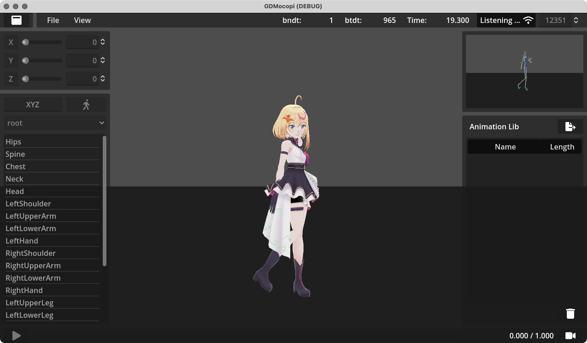

= mocopi Receiver for Godot
:encoding: utf-8
:lang: ja
:author: MizunagiKB <mizukb@live.jp>
:copyright: 2024 MizunagiKB
:doctype: book
:nofooter:
:toc: left
:toclevels: 3
:source-highlighter: highlight.js
:icons: font
:experimental:
:stylesdir: ./docs/res/theme/css
:stylesheet: mizunagi-works.css
ifdef::env-github,env-vscode[]
:adocsuffix: .adoc
endif::env-github,env-vscode[]
ifndef::env-github,env-vscode[]
:adocsuffix: .html
endif::env-github,env-vscode[]

ifdef::env-github,env-vscode[]
link:README.adoc[Japanese] / link:README.en.adoc[English]
endif::env-github,env-vscode[]
ifndef::env-github,env-vscode[]
link:index{adocsuffix}[Japanese] / link:index.en{adocsuffix}[English]
endif::env-github,env-vscode[]

== About

このソフトウェア（以下GDMocopi）は link:https://www.sony.net/Products/mocopi-dev/jp/[SONY mocopi] から送信される情報を Godot Engine で受信するための**非公式**な GDExtension です。

この GDExtension は Godot Engine 4.1 以上で使用可能です。

== 使用方法

基本的な使用方法は、使用したいシーンに GDMocopi と VRM を追加して、VRM のSkeleton3D を GDMocopi に割り当ててください。

ドキュメントはまだ用意されていないのですが、mocopi の情報を受け取って VRM モデルを動かすだけのサンプルとして demo.tscn を用意してあります。

== ライセンス

VRM addon for Godot Engine::
VRMファイルの読み込みに、 V-Sekai/godot-vrm アドオンを使用しています。
https://github.com/V-Sekai/godot-vrm/

RAYNOSちゃん Avatar::
VRMモデルとして RAYNOS-chan-avatar_v1.0.3.zip を使用しています。 +
https://www.sony.net/Products/mocopi-dev/jp/downloads/DownloadInfo.html

== 関連情報

* link:https://www.sony.net/Products/mocopi-dev/jp/[Mobile Motion Capture "mocopi" Developer Site]
* link:https://github.com/seagetch/mcp-receiver[mcp-receiver(GitHub)]
* link:https://github.com/V-Sekai/godot-vrm[VRM addon for Godot Engine]
* link:https://github.com/MizunagiKB/gd_mocopi[MizunagiKB / gd_mocopi (GitHub)]
