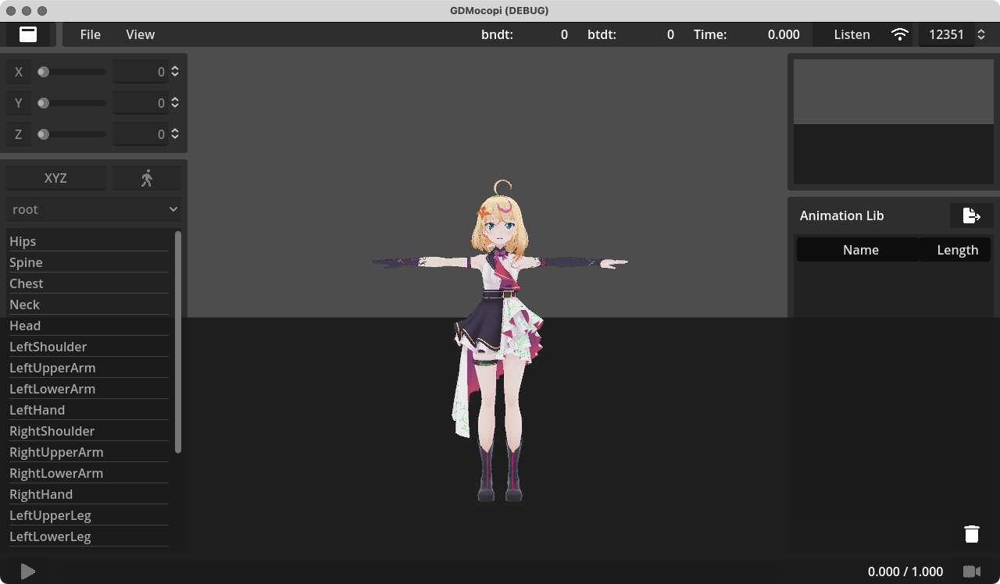

= Usage
:encoding: utf-8
:lang: ja
:author: MizunagiKB <mizukb@live.jp>
:copyright: 2024 MizunagiKB
:doctype: book
:nofooter:
:toc: left
:toclevels: 3
:source-highlighter: highlight.js
:icons: font
:experimental:
:stylesdir: ./res/theme/css
:stylesheet: mizunagi-works.css
ifdef::env-github,env-vscode[]
:adocsuffix: .adoc
endif::env-github,env-vscode[]
ifndef::env-github,env-vscode[]
:adocsuffix: .html
endif::env-github,env-vscode[]

ifdef::env-github,env-vscode[]
Japanese / link:USAGE-cstudio.en.adoc[English]
endif::env-github,env-vscode[]
ifndef::env-github,env-vscode[]
Japanese / link:USAGE-cstudio.en{adocsuffix}[English]
endif::env-github,env-vscode[]

== CStudioの使い方

_CStudio_ は _GDMocopi_ のサンプルとして添付されている GodotEngine プロジェクトです。

サンプルコードとしては、 example_1.tscn, example_2.tscn の方がよりシンプルなものとなっています。

