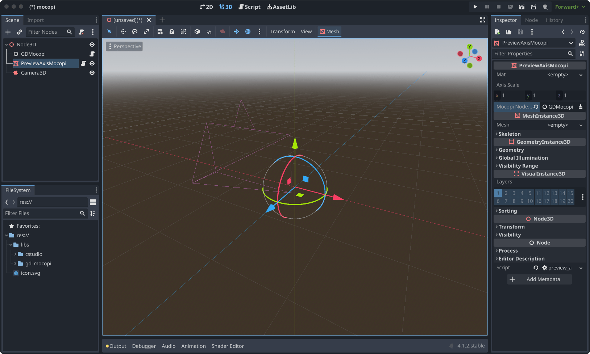
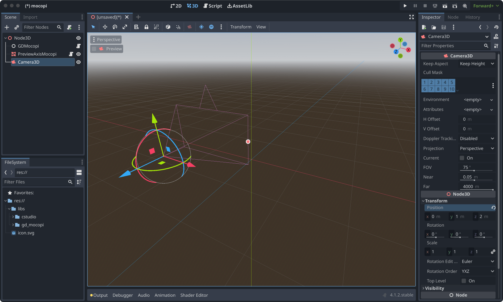
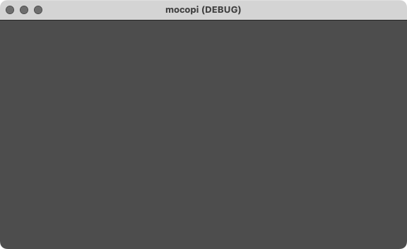
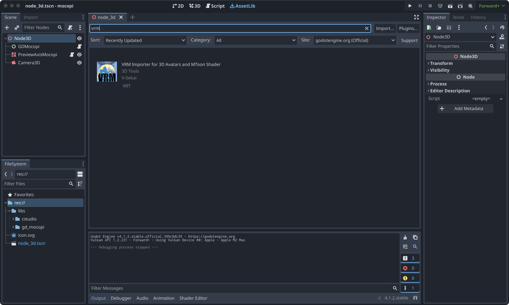
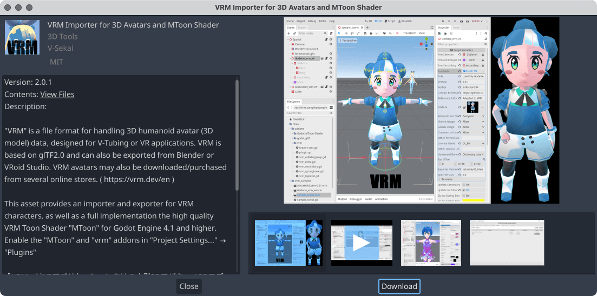
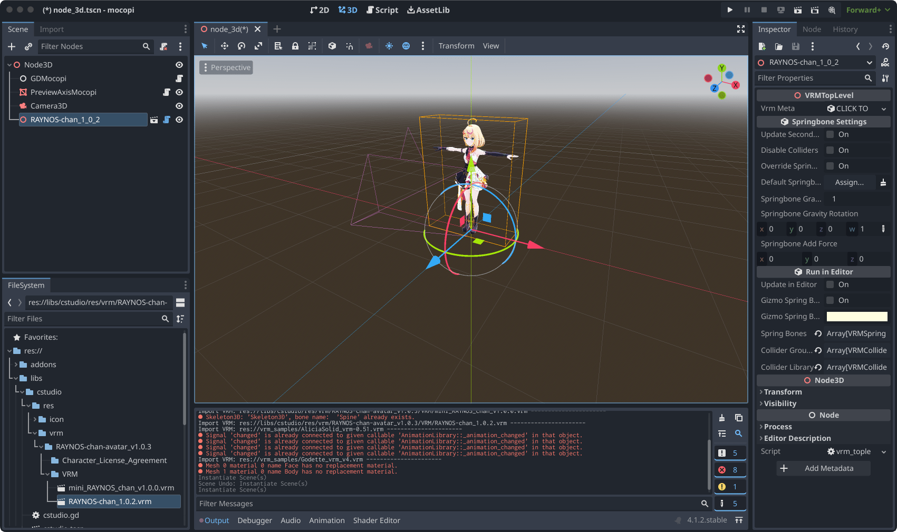
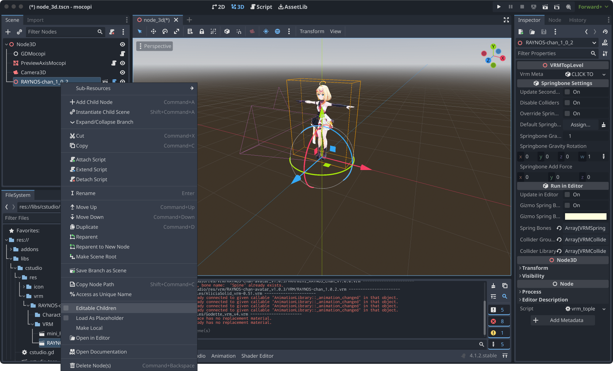
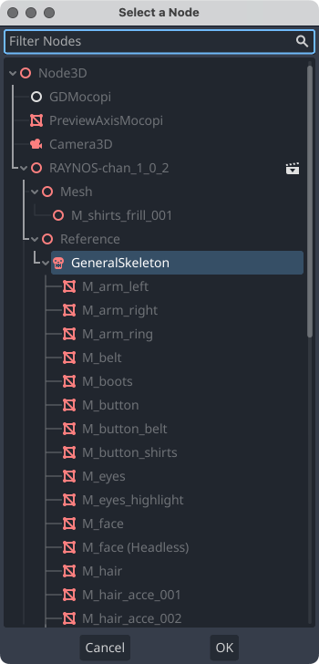
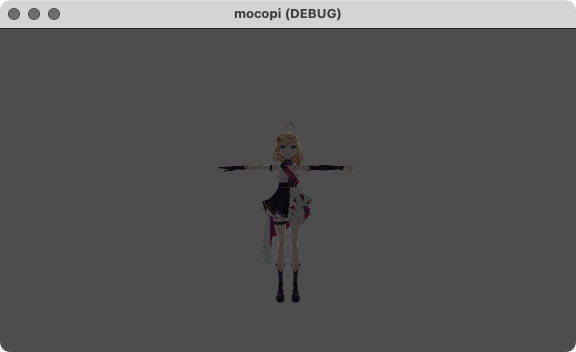
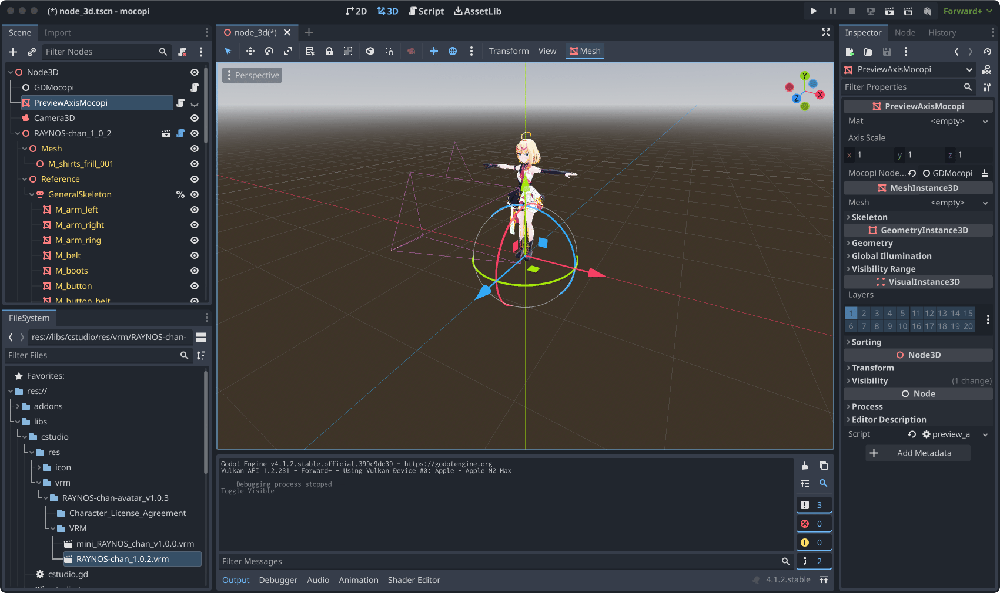

= Usage
:encoding: utf-8
:lang: en
:author: MizunagiKB <mizukb@live.jp>
:copyright: 2024 MizunagiKB
:doctype: book
:nofooter:
:toc: left
:toclevels: 3
:source-highlighter: highlight.js
:icons: font
:experimental:
:stylesdir: ./res/theme/css
:stylesheet: mizunagi-works.css
ifdef::env-github,env-vscode[]
:adocsuffix: .adoc
endif::env-github,env-vscode[]
ifndef::env-github,env-vscode[]
:adocsuffix: .html
endif::env-github,env-vscode[]

ifdef::env-github,env-vscode[]
link:USAGE.ja.adoc[Japanese] / English
endif::env-github,env-vscode[]
ifndef::env-github,env-vscode[]
link:USAGE.ja{adocsuffix}[Japanese] / English
endif::env-github,env-vscode[]

== Usage

To use _GDMocopi_, you'll need the following

* **Godot Engine** (version 4.1 or higher)
* link:https://www.sony.jp/mocopi/[SONY mocopi]
** mocopi
** link:https://play.google.com/store/apps/details?id=com.sony.mocopi[mocopi app for Android] or link:https://apps.apple.com/jp/app/id6444393701?mt=8[mocopi app for iOS]

NOTE: If you don't own SONY mocopi, you can still create a pseudo mocopi communication by obtaining BVH Sender from the link:https://www.sony.net/Products/mocopi-dev/jp/[Developer Site].

=== Preparation

[.lead]
This guide assumes that you have knowledge of the _Godot Engine_. For information about the _Godot Engine_ itself, please refer to the _Godot Engine_ link:https://docs.godotengine.org/ja/4.x/index.html[documentation].

==== Creating a Project

Create a new project.

image:res/images/usage_01.png[]

==== Copying GDMocopi Related Files

Copy all files under the _libs_ folder from the _gd_mocopi_ project. You can copy manually, but you can also copy by directly dropping the _libs_ folder.

image:res/images/usage_02.png[]

==== Creating a Scene

Once the copy is complete, select _3D Scenes_ to create a scene, and add the following nodes under it:

* _GDMocopi_
* _PreviewAxisMocopi_
* _Camera3D_

===== GDMocopi

After adding _GDMocopi_, check _Auto Listen_ in the _Inspector_.

By checking _Auto Listen_, you can automatically accept communication from SONY mocopi when the app is launched.

image:res/images/usage_03.png[]

===== PreviewAxisMocopi

After adding _PreviewAxisMocopi_, set the location of _GDMocopi_ in _Mocopi NodePath_ in the _Inspector_.

image:res/images/usage_04_1.png[]

===== Camera3D

After adding _Camera3D_, open _Transform_ in the _Inspector_ and set y to 1m and z to 2m.

Your preparation is now complete.

==== Sending from mocopi

Now, let’s actually send posture information from mocopi.

Once you launch the app, please either wear mocopi in reality or use BVH Sender to send posture information.

If all goes well, the bone information received from mocopi should be drawn on the screen.

image:res/images/usage_06_1.png[]

If you are not sure about the settings, please refer to _example_1.tscn_. This scene file is in the state where the settings have been made up to this point.

=== Moving VRM

[.lead]
With the work done so far, we are now able to obtain posture information from mocopi. +
Next, let's try applying the obtained posture information to VRM.

==== Making Godot Engine VRM Compatible

To be able to load VRM, you need a separate library.

Install _VRM Importer for 3D Avatars and MToon Shader_ from _Asset Lib_.

At the time of installation completion, Addons are not enabled. Next, open Project Settings and enable MToon Shader and VRM.

Once enabled, reload the project or save and reopen it. When you restart, VRM and MToon Shader will be enabled.

 +
Search for vrm from Asset Lib.

 +
Download VRM Importer for 3D Avatars and MToon Shader.

image:res/images/usage_07_2.png[] +
Select the file to download.

image:res/images/usage_07_3.png[] +
Installation complete.

image:res/images/usage_07_4.png[] +
Enable MToon Shader and VRM from Project Settings.

==== Adding VRM to the Scene

Add the VRM you want to move to the scene.

If you don't have a particular one you want to move, try using the VRM that was downloaded with the Asset addition or RAYNOS which can be downloaded from the SONY mocopi website.

image:res/images/usage_08.png[]

==== Associating mocopi and VRM

Assign the Skeleton3D of VRM to the skel_nodepath of the loaded mocopi.

In the state where only VRM is loaded into the scene, you cannot specify the child hierarchy’s Skeleton3D, so please enable Enable Children from the right-click menu.

Assign Skeleton3D to the skel_nodepath in the Inspector.

 +
Place VRM

 +
Check Editable Children.

image:res/images/usage_09_2.png[] +
Child elements can now be selected.

image:res/images/usage_10.png[] +
Select GDMocopi.

 +
Select Skeleton3D inside VRM.

image:res/images/usage_11_1.png[] +
The movement in SONY mocopi has been reflected.

 +
Please turn off if the display of bone information is in the way.

If you are not sure about the settings, please refer to _example_2.tscn_. This scene file is in the state where the settings have been made up to this point.

