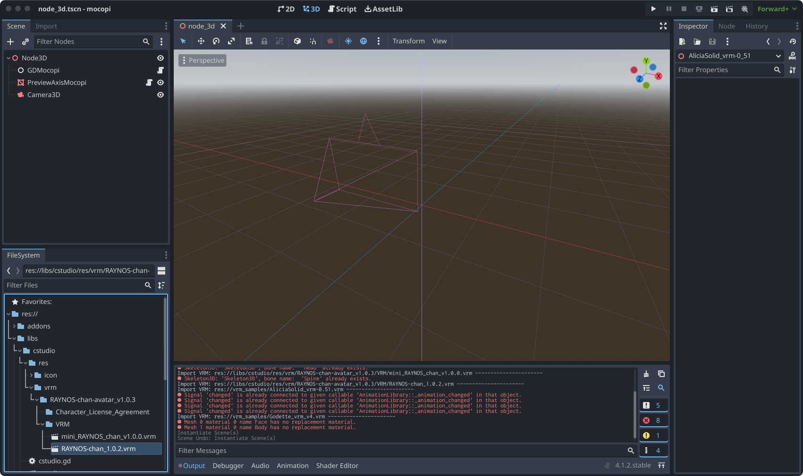
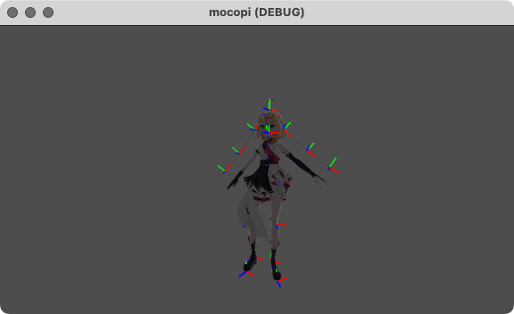

= Usage
:encoding: utf-8
:lang: ja
:author: MizunagiKB <mizukb@live.jp>
:copyright: 2024 MizunagiKB
:doctype: book
:nofooter:
:toc: left
:toclevels: 3
:source-highlighter: highlight.js
:icons: font
:experimental:
:stylesdir: ./res/theme/css
:stylesheet: mizunagi-works.css
ifdef::env-github,env-vscode[]
:adocsuffix: .adoc
endif::env-github,env-vscode[]
ifndef::env-github,env-vscode[]
:adocsuffix: .html
endif::env-github,env-vscode[]

ifdef::env-github,env-vscode[]
Japanese / link:USAGE.en.adoc[English]
endif::env-github,env-vscode[]
ifndef::env-github,env-vscode[]
Japanese / link:USAGE.en{adocsuffix}[English]
endif::env-github,env-vscode[]

== GDMocopiの使い方

_GDMocopi_ を利用するには以下のものが必要となります。

* Godot Engine（4.1 以上）
* link:https://www.sony.jp/mocopi/[SONY mocopi]
** mocopi
** link:https://play.google.com/store/apps/details?id=com.sony.mocopi[android向けのmocopiアプリ] または link:https://apps.apple.com/jp/app/id6444393701?mt=8[iOS向けのmocopiアプリ]

NOTE: SONY mocopi を所有していない場合 +
mocopi本体を所有していない場合は、link:https://www.sony.net/Products/mocopi-dev/jp/[デベロッパーサイト]から BVH Sender を入手することで、擬似的に mocopi からの送信を作り出す事が出来ます。

=== 準備

[.lead]
この説明は _Godot Engine_ の知識をお持ちであることを前提に説明をしています。
_Godot Engine_ 本体については _Godot Engine_ のlink:https://docs.godotengine.org/ja/4.x/index.html[ドキュメント]を参照してください。

==== プロジェクトの作成

新規にプロジェクトを作成します。

==== GDMocopi 関連のファイルをコピー

_gd_mocopi_ プロジェクトから、 _libs_ フォルダ以下を全てコピーします。コピーは手動で行う事もできますが _libs_ フォルダを直接ドロップする事でもコピー出来ます。

==== Scene の作成

コピーが完了したら、 _3D Sceene_ を選択してシーンを作成し、その下にに以下のノードを追加してください。

* _GDMocopi_
* _PreviewAxisMocopi_
* _Camera3D_

===== GDMocopi

_GDMocopi_ を追加したら、 _Inspector_ の _Auto Listen_ にチェックを入れます。

_Auto LIsten_ にチェックを入れると、アプリを起動した際に自動的に SONY mocopi からの通信を受け付ける事が出来ます。

===== PreviewAxisMocopi

_PreviewAxisMocopi_ を追加したら、 _Inspector_ の _Mocopi NodePath_ に _GDMocopi_ の場所を設定します。

image:res/images/usage_04.png[]

===== Camera3D

_Camera3D_ を追加したら、 _Inspector_ の _Transform_ を開いて、 y を 1m、 z を 2m に設定します。

image:res/images/usage_05.png[]

これで準備が完了しました。

==== mocopi から送信

それでは実際に _mocopi_ から姿勢情報を送信してみます。

アプリを立ち上げたら、 _mocopi_ を実際に身につけるか、 _BVH Sender_ を使って姿勢情報を送信をしてください。

うまくいけば、画面に _mocopi_ から受け取った骨の情報が描画されるはずです。

image:res/images/usage_06.png[]

設定方法がよく解らない場合は、 _example_1.tscn_ を参考にしてみてください。このシーンファイルはここまでの設定を行った状態のものとなっています。

=== VRM を動かす

[.lead]
ここまでの作業で _mocopi_ から姿勢情報を取得できる様になりました。
次は取得した姿勢情報を _VRM_ に適用させてみましょう。

==== Godot Engine を VRM 対応にする

VRM を読み込める様にするには、別途ライブラリが必要となります。

_AssetLib_ から _VRM Importer for 3D Avatars and MToon Shader_ をインストールしましょう。

インストールが完了した時点では _Addons_ は有効になっていません。次に _Project Settings_ を開いて、 _MToon Shader_ と _VRM_ を有効にします。

有効にしたら、プロジェクトをリロードするか保存してから開き直してください。立ち上げ直すと _VRM_ と _MToon Shader_ が有効になります。

image:res/images/usage_07.png[] +
_AssetLib_ から _vrm_ で検索。

image:res/images/usage_07_1.png[] +
_VRM Importer for 3D Avatars and MToon Shader_ を Download します。

 +
ダウンロード対象のファイルを選択。

image:res/images/usage_07_3.png[] +
インストール完了。

 +
_Project Settings_ から _MToon Shader_ と _VRM_ を有効にします。

==== シーンに VRM を追加

動かしたい _VRM_ をシーンに追加します。

特に動かしたいものがない場合は、_Asset_ の追加時に一緒にダウンロードされた _VRM_ や _SONY mocopi_ のウェブサイトからダウンロードできる _RAYNOS_ ちゃんを使用してみてください。

image:res/images/usage_09.png[]

==== mocopi と VRM との関連付け

読み込んだ mocopi の skel_nodepath に VRM の Skeleton3D を割り当てます。

VRM をシーンに読み込んだだけの状態では、子階層の Skeleton3D を指定出来ませんので、右クリックメニューから Enable Children を有効にしてください。

Inspector の skel_nodepath に Skeleton3D を割り当てます。

image:res/images/usage_09.png[] +
VRMを配置

image:res/images/usage_09_1.png[] +
Editable Children にチェックを入れます。

 +
子要素を選択可能になりました。

 +
_GDMocopi_ を選びます。

image:res/images/usage_10_1.png[] +
_VRM_ 内の _Skeleton3D_ を選択します。

image:res/images/usage_11.png[]

 +
SONY mocopi での動きが反映されるようになりました。

image:res/images/usage_12.png[] +
骨情報の表示が邪魔な場合は Off にしてください。

設定方法がよく解らない場合は、 _example_2.tscn_ を参考にしてみてください。このシーンファイルはここまでの設定を行った状態のものとなっています。